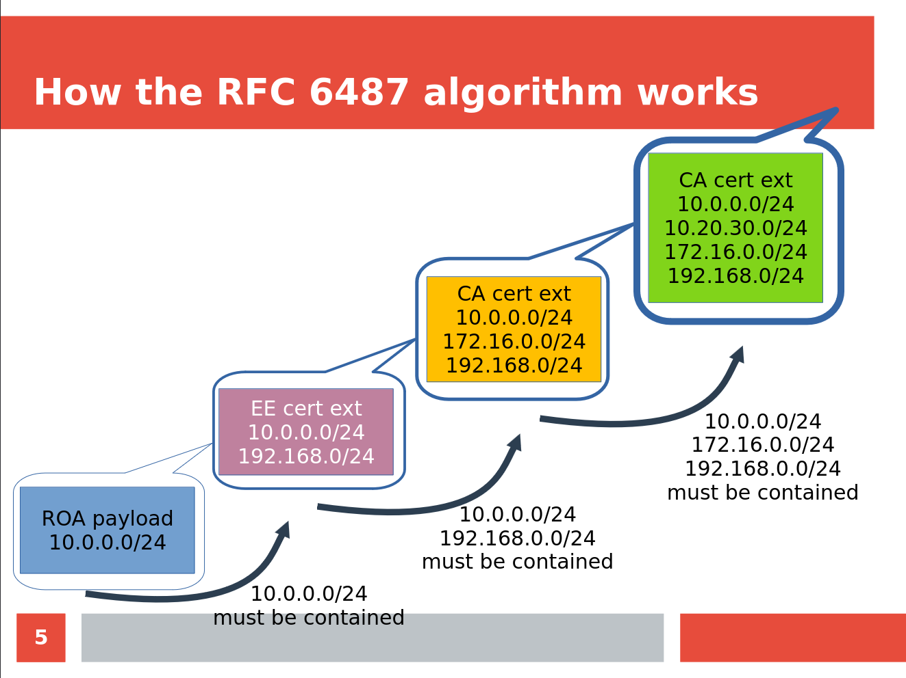
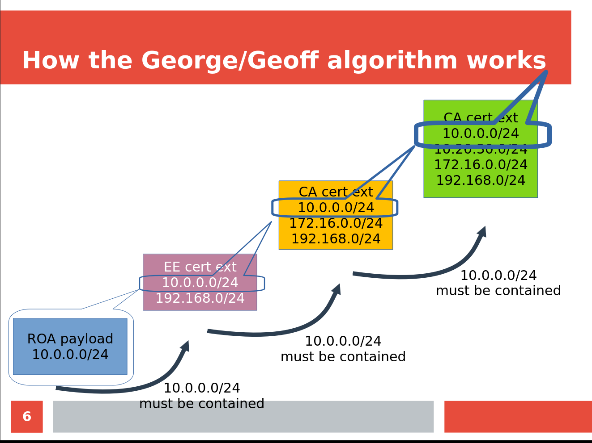
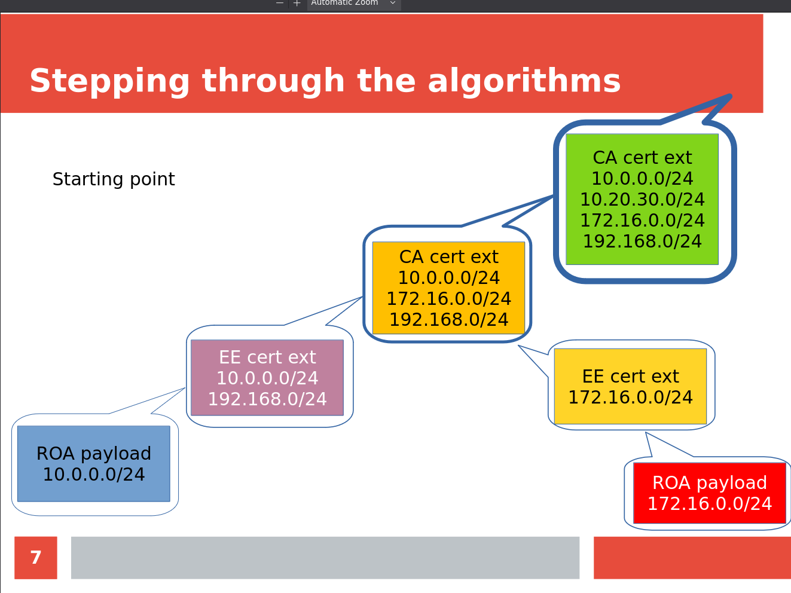
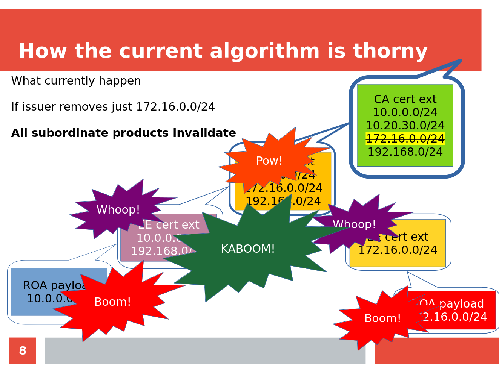
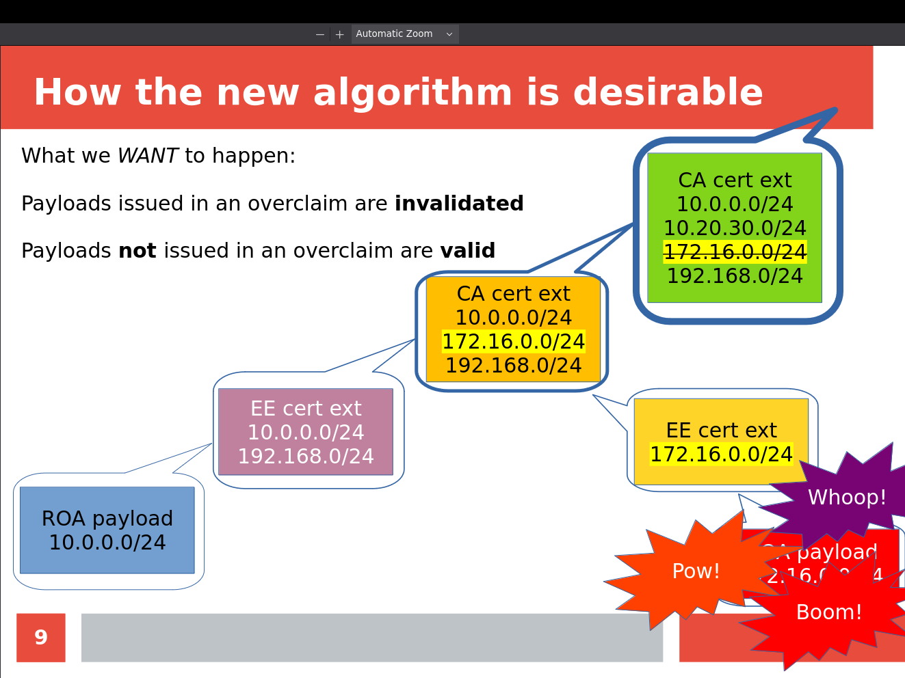

<!-- _class: lead invert -->
# IETF Activity Update

What's going on, and why we should care...

**Ben Maddison**
[*benm@workonline.africa*](mailto:benm@workonline.africa)

# Focus areas and working groups

As an IP transit network operator, I mostly care about:

- BGP protocol developments (`idr`)
- Routing security (`sidrops`, `savnet`)
- Internet routing operations (`grow`)

... and as an interconnection community, so should you!

# BGP protocol updates - `idr`

Maintenance of BGP itself is handled by the `idr` working group

-   Long list of current work items
-   Mostly noise!
    - BGP-LS nonsense
    - SRv6 nonsense
    - SD-WAN nonsense

*One important exception...*

# BGP SendHoldTimer

[`draft-ietf-idr-bgp-sendholdtimer`]

Proposal to deal with stuck BGP neighbors that we can't send messages to.

status: **in WGLC** - go indicate your support

[`draft-ietf-idr-bgp-sendholdtimer`]: https://datatracker.ietf.org/doc/draft-ietf-idr-bgp-sendholdtimer/

# Routing security - `sidrops`/`savnet`

-   Various source address validation proposals in `savnet`
    - all variations on "uRPF with better data"
    - meh!

-   Lots of RPKI related work in-flight
    - full I-D list available on the [`sidrops`] datatracker page
    - some highlights...

[`sidrops`]: https://datatracker.ietf.org/wg/sidrops/documents/

# ASPA

[`draft-ietf-sidrops-aspa-profile`]
[`draft-ietf-sidrops-aspa-verification`]
[`draft-ietf-sidrops-8210bis`]

- Still the most important new use-case for the RPKI
- Currently delayed due to pending changes to the RPKI-RTR protocol draft
- Slightly frustrating :-(

[`draft-ietf-sidrops-aspa-profile`]: https://datatracker.ietf.org/doc/draft-ietf-sidrops-aspa-profile/
[`draft-ietf-sidrops-aspa-verification`]: https://datatracker.ietf.org/doc/draft-ietf-sidrops-aspa-verification/
[`draft-ietf-sidrops-8210bis`]: https://datatracker.ietf.org/doc/draft-ietf-sidrops-8210bis/

# ROA profile update

[`draft-ietf-sidrops-rfc6482bis`]

Updates the ROA object profile based on lessons learned since RFC 6482 was published:

- Clarifies and tightens requirements for IP address resource ordering and validation
- Improves the constraints in the ASN.1 module
- Fully backwards compatible - no version bump
- Currently in the RFC editor queue

[`draft-ietf-sidrops-rfc6482bis`]: https://datatracker.ietf.org/doc/draft-ietf-sidrops-rfc6482bis/

# RPKI validation re-reconsidered

[`draft-ietf-sidrops-rpki-validation-update`]

-   The current [RFC 6487] validation algorithm for RPKI signed objects is fragile
    - ... we've know this for a decade!
-   [RFC 8360] proposed an improved algorithm
    - ... but required coordinated implementation by *all* CAs and RPs
-   This draft proposes an alternative implementation strategy
-   Adopted as a WG document last week! 🥳🥳🥳

[`draft-ietf-sidrops-rpki-validation-update`]: https://datatracker.ietf.org/doc/draft-ietf-sidrops-rpki-validation-update/
[RFC 6487]: https://datatracker.ietf.org/doc/rfc6487/
[RFC 8360]: https://datatracker.ietf.org/doc/rfc8360/

---

---

---

---

---

# **Don't** signal ROV-state in BGP

[`draft-ietf-sidrops-avoid-rpki-state-in-bgp`]

-   Multiple vendor and community sources have suggested signalling have previously recommended signalling RPKI-derived validation state in BGP (e.g. using communities)
-   At best, this is pointless, at worst it is harmful
    - Every change in the RPKI causes churn in the DFZ :-(
-   Don't do it!

[`draft-ietf-sidrops-avoid-rpki-state-in-bgp`]: https://datatracker.ietf.org/doc/draft-ietf-sidrops-avoid-rpki-state-in-bgp/

# Miscellaneous

- [`draft-ietf-sidrops-signed-tal`]: TA key rollover signalling
- [`draft-ietf-sidrops-rpki-prefixlist`]: Successor to IRR route-sets?
- [`draft-ietf-sidrops-cms-signing-time`]: Graceful fall back from RRDP to RSYNC
- [`draft-timbru-sidrops-publication-server-bcp`]: Publication service best practises
- [`draft-harrison-sidrops-manifest-numbers`]: Correct `manifestNumber` handling
- And many more... see [the `sidrops` datatracker page](https://datatracker.ietf.org/wg/sidrops/documents/)

[`draft-ietf-sidrops-signed-tal`]: https://datatracker.ietf.org/doc/draft-ietf-sidrops-signed-tal/
[`draft-ietf-sidrops-rpki-prefixlist`]: https://datatracker.ietf.org/doc/draft-ietf-sidrops-rpki-prefixlist/
[`draft-ietf-sidrops-cms-signing-time`]: https://datatracker.ietf.org/doc/draft-ietf-sidrops-cms-signing-time/
[`draft-timbru-sidrops-publication-server-bcp`]: https://datatracker.ietf.org/doc/draft-timbru-sidrops-publication-server-bcp/
[`draft-harrison-sidrops-manifest-numbers`]: https://datatracker.ietf.org/doc/draft-harrison-sidrops-manifest-numbers/

# Internet Routing Operations - `grow`

-   Lots of iterative improvements to BMP in-flight
    - chat to me outside if that's your jam ;-)
-   NRTM version 4 is in flight still
-   Peering automation API proposal

# NRTM version 4

- Successor to NRTM version 3, used to mirror IRR databases
- First attempt at standardising an NRTM spec in the IETF
- Loosely modelled after RRDP + object security
- Implemented in IRRd4 and RIPE

# Peering API

- API specification for M2M peering session provisioning workflow
- Intended as a solution to the proliferation of operator-specific "peering portals"
- Very early draft, lots of work to do on the workflow and authentication models
- WG adoption expected to start shortly - good opportunity to comment on the idea

# FIN?
<!-- _class: lead invert -->
